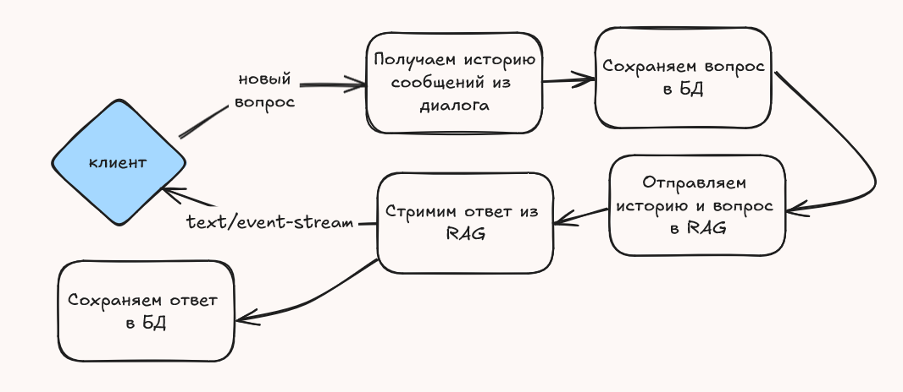

# MZHN CHATS SERVICE

Сервис работы с чатами

## :gear: Технологии

Необходимое окружение

- PostgreSQL
- [Auth-сервис](https://github.com/mzhn-mzhnr/auth)
- [RAG-сервис](https://github.com/mzhn-mzhnr/ai)

Стек:

- Go 1.22
- [pgx](https://github.com/jackc/pgx) (драйвер для работы с PostgreSQL)
- [wire](https://github.com/google/wire) (compile-time DI-контейнер)

## :rocket: Flow отправки сообщения



## :screwdriver: Конфигурация

Приложение настраивается при помощи переменных среды (Environment variables)

Пример конфигурации находиться в `example.env`
Выполните эту команду, чтобы скопировать пример

```bash
cp example.env .env
```

После чего отредактируйте файл `.env` в вашем текстовом редакторе

## :rocket: DEPLOY

> [!Note]
> Обязательно настройте конфиг приложения. [Как это сделать?](#screwdriver-конфигурация)

### :whale: Docker

1. Склонируйте репозиторий `git clone  https://github.com/mzhn-mzhnr/chats.git`

2. Для запуска приложения в docker-контейнере используйте

```bash
docker compose up --build
```

При запуске таким образом миграции для базы данных применяться автоматически

### :desktop_computer: Локальная сборка

Для локальной сборки был описан `Makefile`
Для сборки выполните команду

```bash
$ make
```

В результате в корне репозитория создасться папка `bin/` в которой будет расположен исполняемый файл `app.exe`

> [!Note]
> Для применения конфигурации в локальном режиме из `.env` используйте флаг `-local`

```bash
$ ./cmd/app.exe -local
```

Для применения миграции требуется выполнить команду

```bash
go run ./cmd/migrator/main.go
```
